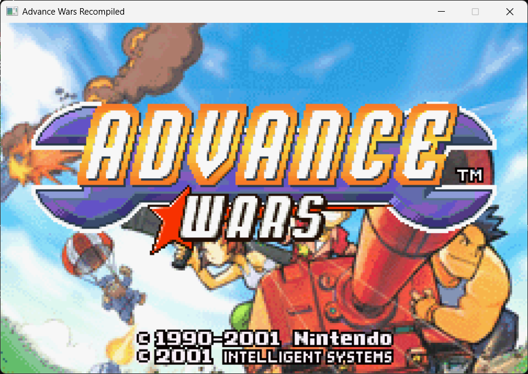

# Advance Wars Recompiled

**The first GBA game to be statically recompiled to native code.**

```
    ___       __                              _       __
   /   | ____/ /   ______ _____  ________   | |     / /___ ___________
  / /| |/ __  / | / / __ `/ __ \/ ___/ _ \  | | /| / / __ `/ ___/ ___/
 / ___ / /_/ /| |/ / /_/ / / / / /__/  __/  | |/ |/ / /_/ / /  (__  )
/_/  |_\__,_/ |___/\__,_/_/ /_/\___/\___/   |__/|__/\__,_/_/  /____/
                    R E C O M P I L E D
```

> **Historic first.** On March 19, 2026, Advance Wars became the first Game Boy Advance game to be statically recompiled and rendered natively on a PC. Built from scratch in 48 hours using [gbarecomp](https://github.com/sp00nznet/gbarecomp) -- the first GBA static recompilation toolkit.

## Proof of Life



*Advance Wars title screen running natively on Windows x64. The complete intro plays, menus work, and training missions are playable. ARM7TDMI machine code statically recompiled to C, compiled with MSVC, rendered pixel-perfect by mGBA's PPU through SDL2 at 60fps.*

## What Is This?

This project takes the original **Advance Wars** (GBA, 2001) ROM and statically recompiles it into native code that runs on modern hardware -- no emulator required. The game's ARM7TDMI instructions are translated to C, compiled with a modern toolchain, and linked against [libmgba](https://github.com/mgba-emu/mgba) for pixel-perfect hardware emulation.

The result? Advance Wars running natively on your PC.

## Why?

Because Andy, Max, Sami, and the rest of the crew deserve better than being trapped on a 20-year-old handheld. Because Intelligent Systems made something genuinely special and the world should be able to play it forever. Because static recompilation is one of the coolest preservation techniques in gaming and the GBA deserves the same love the N64 has been getting.

**Advance Wars** is a masterclass in turn-based strategy:
- Fog of war that actually creates tension
- CO Powers that turn the tide of battle
- A campaign that teaches you to think three turns ahead
- Multiplayer that ruins friendships (in the best way)

## How It Works

```
[Advance Wars ROM]
        |
        v
[gbarecomp] -- Static recompiler (ARM7TDMI -> C)
        |
        v
[6,289 C functions across 63 source files]
        +
[libmgba runtime] -- PPU, DMA, timers, interrupts
        +
[SDL2] -- Display, input
        |
        v
[AWRE.exe] -- 8MB native Windows executable
```

## Project Status

| Milestone | Status |
|-----------|--------|
| ROM analysis & disassembly | **Done** -- 6,289 functions, 57K+ basic blocks |
| ARM instruction translation | **Done** -- Full ARM7TDMI instruction set |
| Thumb instruction translation | **Done** -- All 19 Thumb formats |
| C code generation | **Done** -- 1.1M lines across 63 files |
| Memory bus (libmgba) | **Done** -- All GBA memory regions |
| PPU rendering (libmgba) | **Done** -- All modes, sprites, effects |
| DMA / Timers / IRQ (libmgba) | **Done** -- Accurate hardware emulation |
| Binary compiles & links | **Done** -- 8MB native x64, 0 errors |
| Game boots & initializes | **Done** -- mGBA CPU handles IWRAM init code |
| **Title screen renders** | **Done** -- First GBA game recompiled! |
| **Full gameplay** | **Done** -- Intro, menus, training missions playable |
| **Function interception** | **Done** -- Native C execution via ARMRunLoop hook, 0 failures |
| **ImGui menu** | **Done** -- File/Config/Graphics/Audio/Controller |
| **Save file** | **Done** -- Flash auto-detected, persistent across sessions |
| **Configurable controls** | **Done** -- Click-to-rebind keyboard + gamepad |
| Audio | In progress -- SDL callback wired, needs resampler fix |
| Save states | In progress -- File > Save/Load State slots |

## Related Projects

### Recompilation
- **[gbarecomp](https://github.com/sp00nznet/gbarecomp)** -- The recompilation toolchain that makes this possible. The first GBA static recompiler.
- **[N64Recomp](https://github.com/N64Recomp/N64Recomp)** -- The pioneering N64 static recompiler. 9+ games ported. Major inspiration.
- **[gb-recompiled](https://github.com/arcanite24/gb-recompiled)** -- Static recompiler for original Game Boy.

### Advance Wars Community
- **[ketsuban/advancewars](https://github.com/ketsuban/advancewars)** -- Advance Wars decompilation (byte-matching). Incredible reverse engineering work.
- **[Eebit/aw2bhr](https://github.com/Eebit/aw2bhr)** -- Advance Wars 2: Black Hole Rising decompilation.

### GBA Emulation & Tools
- **[mGBA](https://github.com/mgba-emu/mgba)** -- The excellent GBA emulator whose `libmgba` core powers our hardware runtime.
- **[GBATEK](https://problemkaputt.de/gbatek.htm)** -- The definitive GBA technical reference.
- **[pret](https://pret.github.io/)** -- GBA decompilation community hub.
- **[decomp.dev](https://decomp.dev/projects)** -- Track decompilation progress across all platforms.

## Want to Help?

This is a big, ambitious project and we'd love help from anyone who's passionate about:
- **ARM reverse engineering** -- GBA uses ARM7TDMI with ARM/Thumb interworking
- **Compiler/toolchain development** -- The recompiler is the heart of everything
- **GBA hardware internals** -- PPU timing, DMA edge cases, audio mixing
- **Advance Wars** -- If you love this game, you belong here
- **Other GBA games** -- The toolkit is game-agnostic. Pick your favorite and try it!

## Legal

This project does not distribute any copyrighted game data. You must provide your own legally obtained ROM. The recompilation tools and runtime are open source. The GBA hardware runtime is based on [mGBA](https://github.com/mgba-emu/mgba) (MPL-2.0).

---

*"It's your turn, and you've got nothing to lose."*

*Built with Claude Code. From zero to first GBA recomp in 48 hours. Native function interception and full gameplay in 96.*
