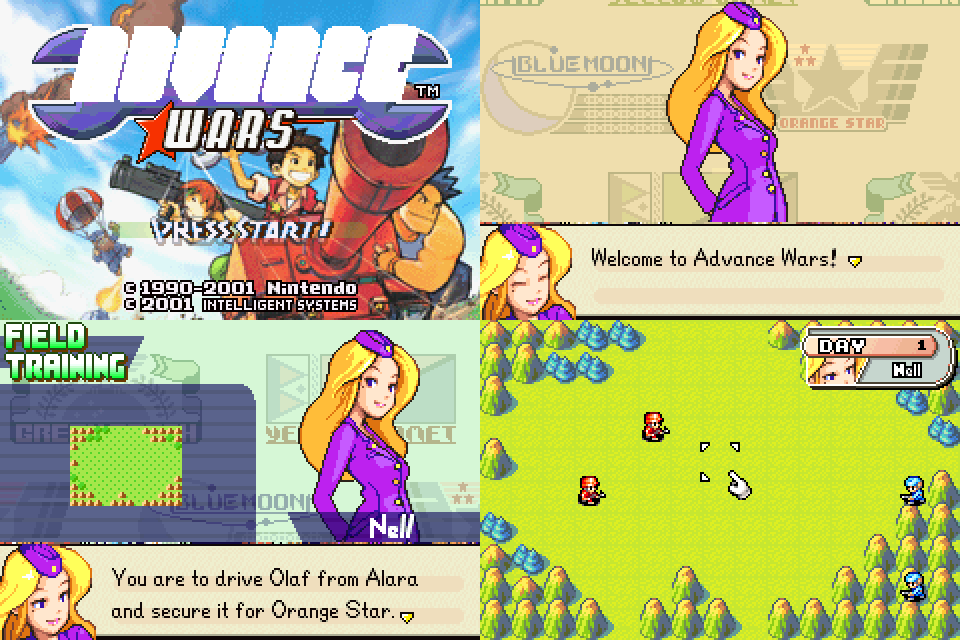
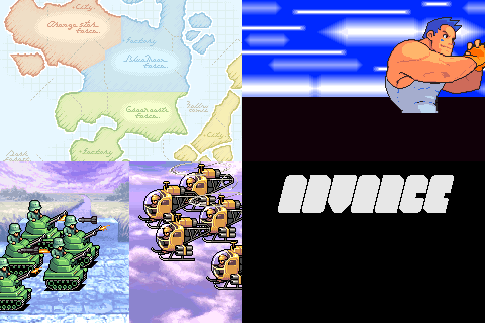

# Advance Wars Recompiled

A static recompilation of **Advance Wars** (GBA, 2001) to a native Windows
executable, built from your own ROM with the
[gbarecomp](https://github.com/sp00nznet/gbarecomp) toolkit. The game's ARM and
Thumb code is translated to C and compiled; no emulator runs underneath.

Follows the recomp house style shared with snesrecomp, lynxrecomp, xboxrecomp,
ps3recomp and pcrecomp: the toolkit lives in its own repo, generated code is
never committed, and every build runs headless.

## Status

**Alpha.** The game runs through the menus into Field Training's first
battle; full play of a mission hasn't been checked yet, and there's no audio.

| Milestone | State |
|---|---|
| Recompiles and builds | Yes: 7384 functions, all ROM code native, about a minute to compile |
| Boots, loads and writes the save (Flash) | Yes |
| Attract intro | Plays in full: map, CO cut-ins, battle scenes, logo |
| Title screen | Yes, with logo and PRESS START |
| Menus, name entry, Nell's tutorial | Yes, screen for screen with mGBA (`tools/field_training.txt`) |
| Field Training battle | The map, units, HUD and cursor come up and the tutorial runs; playing it out is next |
| Sound driver (m4a) | Runs (music state advances as on hardware); no audio output yet |
| Graphics | Per-scanline rendering, priorities, alpha/brightness effects, affine BGs; missing windows (transition wipes), mosaic, affine sprites |
| Conformance (lockstep validation) | 151/151 functions agree |

An earlier version of this repo (March 2026) ran a hybrid: libmgba executed the
CPU and recompiled functions were swapped in from its run loop. It reached the
menus and training missions that way, but it wasn't a static recompilation and
has been retired. See [CHANGELOG.md](CHANGELOG.md).

## Screenshots

From the recompiled build, captured with `--headless --screenshot`:





## Getting Started

You need your own **Advance Wars (USA) (Rev 1)** ROM
(SHA1 `15053499d5b3f49128a941d7f2d84876f5424d0c`). Nothing here downloads or
bundles it.

### Quick start

1. Download this repo (Code > Download ZIP) and unzip it, or clone it.
2. Double-click **`Setup.cmd`**. It checks for Visual Studio 2022 (C++), CMake,
   git and SDL2, and offers to install what's missing (Visual Studio you install
   yourself: it tells you which workload). It fetches the toolkit, finds your ROM
   (beside the repo or in Downloads, `.gba` or `.zip`) or asks for its path,
   builds, and makes a launcher. If a step fails it says what to do in one
   sentence and keeps the details in `setup.log`; run it again and finished
   steps are skipped.
3. Double-click **`Advance Wars (recomp).cmd`**.

### Step by step

1. Prerequisites: Visual Studio 2022 or its Build Tools with *Desktop
   development with C++*; CMake 3.16+; git; and SDL2 from vcpkg:
   ```
   git clone https://github.com/microsoft/vcpkg C:\vcpkg
   C:\vcpkg\bootstrap-vcpkg.bat
   C:\vcpkg\vcpkg install sdl2:x64-windows
   ```
   With vcpkg elsewhere, `set VCPKG_ROOT=<path>` before building.
2. Clone with the toolkit:
   ```
   git clone --recursive https://github.com/sp00nznet/advancewars
   cd advancewars
   ```
   (Already cloned without `--recursive`: `git submodule update --init`.)
3. Put your ROM at `game\aw.gba`.
4. Build:
   ```
   build.cmd
   ```
   It ends with `Built build\Release\AWRE.exe`. The generated C is in
   `gen\` and stays on your machine.
5. Run:
   ```
   build\Release\AWRE.exe game\aw.gba
   ```
   Keys: arrows, Z = A, X = B, Enter = Start, Backspace = Select, A/S = L/R.

Trip-ups: run `build.cmd` from a normal Command Prompt (it finds Visual Studio
through CMake, so a Developer Prompt isn't needed); after installing CMake or
git, open a new window so `PATH` picks them up.

## Usage

Headless runs (no window; work over RDP), recordings and screenshots use the
toolkit's runtime flags ([docs/headless.md](https://github.com/sp00nznet/gbarecomp/blob/main/docs/headless.md)):

```
build\Release\AWRE.exe game\aw.gba --headless --frames 600 --screenshot f600.bmp
build\Release\AWRE.exe game\aw.gba --record intro.mp4 --frames 3600
build\Release\AWRE.exe game\aw.gba --headless --input tools\field_training.txt --frames 8000 --screenshot battle.bmp
```

Conformance (needs the ROM; prints a SKIP line without it):

```
py -3 ext\gbarecomp\tools\conformance.py --exe build\Release\AWRE.exe --rom game\aw.gba ^
   --baseline conformance_baseline.txt --input tools\title.txt --frames 760
conformance: 151/151 functions agree (details: scratch\conformance.log)
```

## Building from source

`build.cmd` is the whole build; see Step by step. Notes on the game's code,
the save format and the addresses that matter are in
[docs/architecture.md](docs/architecture.md).

## Related projects

- [gbarecomp](https://github.com/sp00nznet/gbarecomp): the toolkit.
- [ketsuban/advancewars](https://github.com/ketsuban/advancewars): the Advance Wars decompilation.
- [mGBA](https://github.com/mgba-emu/mgba): the reference the build is checked against.
- [GBATEK](https://problemkaputt.de/gbatek.htm): the GBA hardware reference.

## Legal

No game data is included or distributed: you supply your own ROM, and the C
generated from it stays in the gitignored `gen/` directory on your machine.

## License

MIT for the code in this repo, see [LICENSE](LICENSE). Advance Wars is a
trademark of Nintendo and Intelligent Systems; this project is not affiliated
with them.
